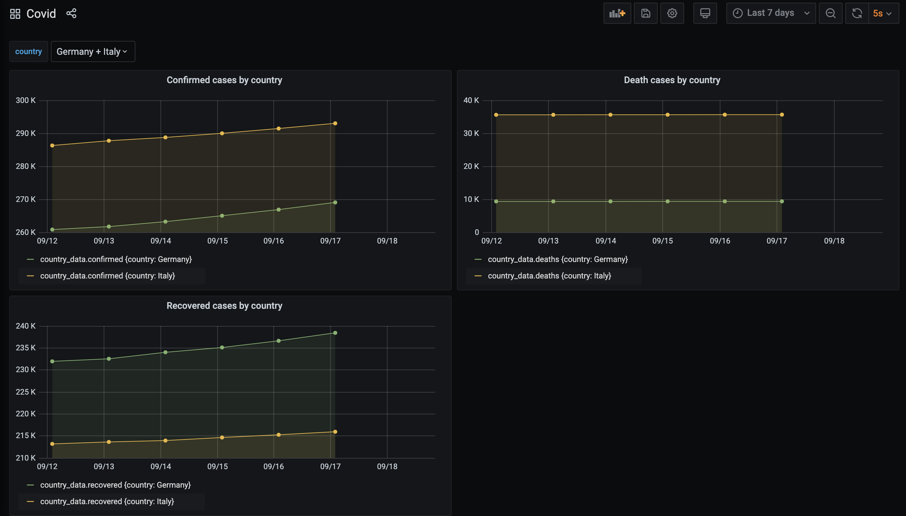

# Covid Stats

[](https://docs.python.org/3/)
[](https://github.com/psf/black)
[](http://mypy-lang.org/)
[](https://pycqa.github.io/isort/)
[](https://grafana.com/)
[](https://prometheus.io/)
[](https://www.influxdata.com/)

The aim of this project is to retrieve COVID-19 statistics and plot in Grafana.

Specifically, it retrieves confirmed, death and recovered cases for all the countries except United States (due to API limitations)
from the 1st January 2020.
The external API to retrieve raw data is: [covid19api](https://covid19api.com/).

# Table of Contents

* [Architecture](#Architecture)
* [Usage](#usage)
* [Contributing](#contributing)

## Architecture

The Application at the start-up fetches all the historical data until today.
Then every day it gets the data concerning the day before due to the [covid19api](https://covid19api.com/) limitation.


## Usage

First you need to clone the repository: 
```shell script
git@github.com:anjelo95/covid-stats.git
```
Then inside the repository run the start script:
```shell script
cd covid-stats
sh start.sh
```

The you need to configure the datasource and dashboard for `Grafana`:
- visit the page: `localhost:3000`
- add the `InfluxDB` datasource using as address: `http://influxdb:8086` and database name: `covid_stast_by_country`
- import the dashboard located inside: `grafana/dashboards/covid.json`



## Contributing

Open a PR on the master branch.